#  Mini Account Management System
The Mini Account Management System is a foundational financial application developed using ASP.NET Core with Razor Pages and MS SQL Server. This project serves as a comprehensive demonstration of key accounting functionalities, robust data management practices, and strict adherence to the use of stored procedures for all database interactions, ensuring no LINQ usage for data access operations. It's designed to provide a solid understanding of how to build a clean, scalable, and secure financial system with a focus on backend robustness and efficient database interaction.


##  Getting Started
To get a local copy up and running, follow these simple steps:

###  Prerequisites
Ensure you have the following installed on your machine:

-  .NET SDK 8.0 or higher (or the specific version you used)
-  SQL Server (2022 or later recommended)
-  Visual Studio 2022 (Community Edition is fine) or Visual Studio Code

###  Installation

**Clone the repository**:
```Bash
git clone https://github.com/MdALSiyam/Mini-Account-Management-System.git
```
```Bash
cd Mini-Account-Management-System
```

**Restore NuGet Packages**:
```PM
dotnet restore
```

**Update Connection String**:  Open `appsettings.json` in the `Siyam_MiniAccountManagementSystem` project and update the `DefaultConnection` string to point to your SQL Server instance:
```json
  "ConnectionStrings": {
    "DefaultConnection": "Server=(LocalDB)\\MSSQLLocalDB;Database=Siyam_MiniAccountDB10;Trusted_Connection=True;MultipleActiveResultSets=true;"
  },
```

**Create Migrations**
```PM >
Add-Migration InitialSetup
```

**Update the Databse**
```PM >
Update-Database
```

**Tables:**  Open database Siyam_MiniAccountDB10 from SQL Server Object Explorer in Visual Studio 2022. Right click the database and open new query, Copy queries from **Tables.sql** file and paste in that new query and execute one by one.

**Stored Procedures:**  Similarly. Copy and paste queries from **Stored-Procedures.sql** and execute one by one.

**Run Project:**  To run the project, press F5 or click the IIS Express button in Visual Studio 2022.


### Default Users for Testing

For easy testing of different roles and permissions, the application is pre-seeded with the following default users:

|     Role    |      Username        |    Password   |        Accessible Modules      |
| :---------- | :------------------- | :------------ | :----------------------------- |
|  **Admin**  |  `siyam@gmail.com`   |  `Siyam@123`  |  Accounts, Voucher, User/Role  |


##  📸  Project Outputs


###  🧾  Registration as a Viewer
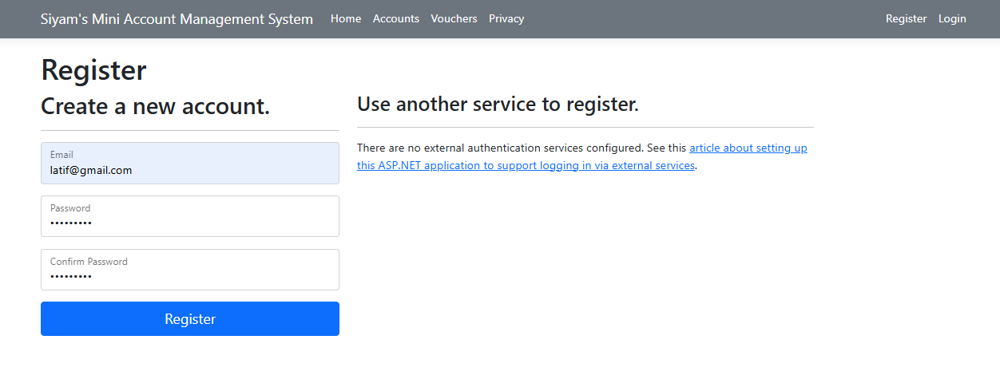


###  🧾  Login as a Viewer
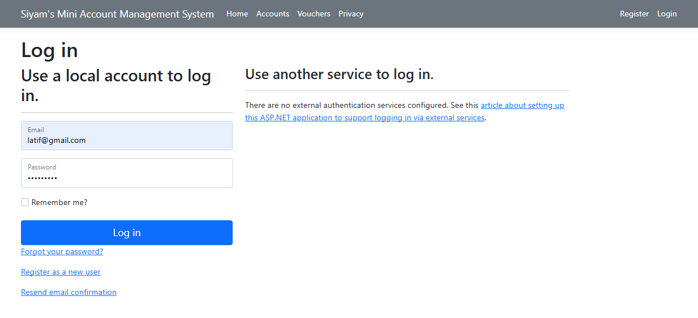


###  🧾  Viewer can access only Home Page and Privacy Page
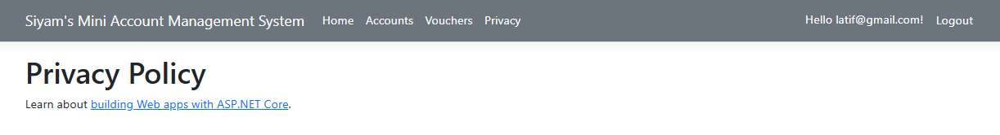


###  🧾  But, Viewer can not aceess Account Page and Voucher Page
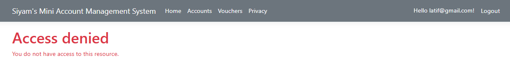
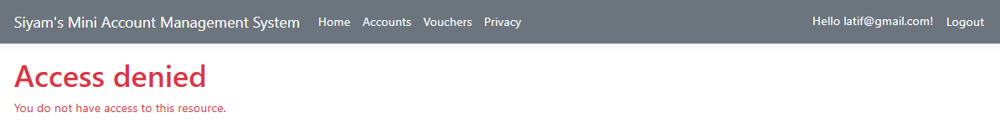


###  🧾  Login as Admin
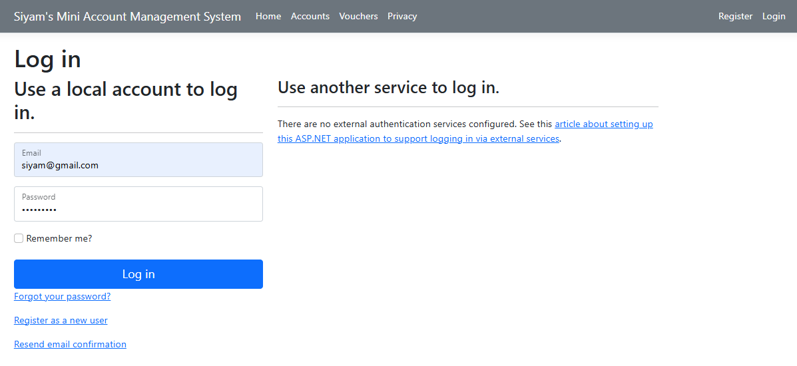


**Admin can access all pages including Account Page, Voucher Page etc.**


###  🧾  Account List Page


###  🧾  Account Details Page


###  🧾  New Account is Creating
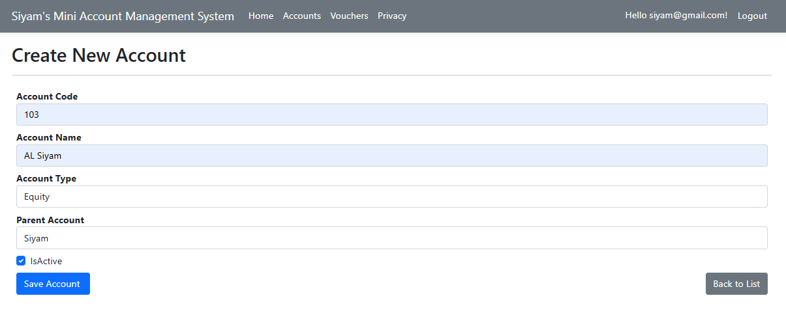
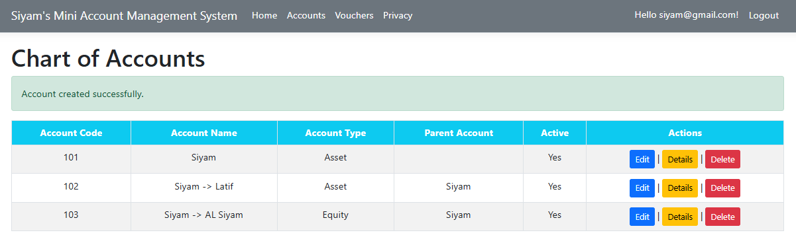


###  🧾  Existing Account is Updating
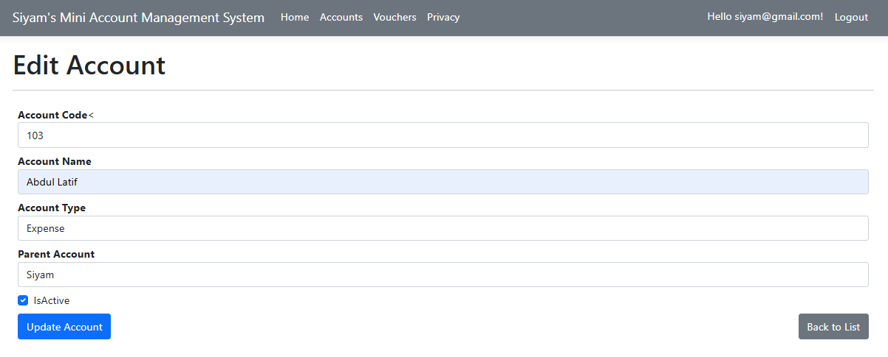
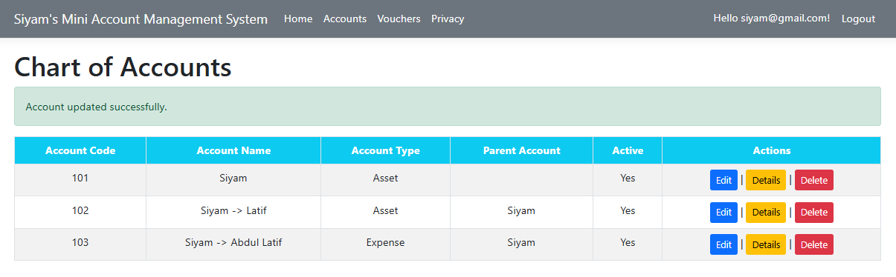


###  🧾  Existing Account is Deleting
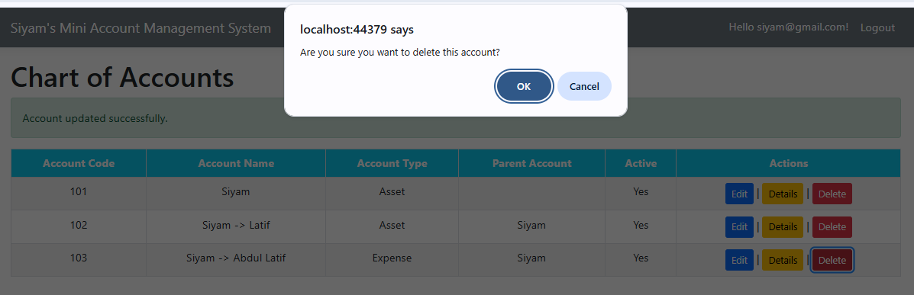


###  🧾  Voucher List Page
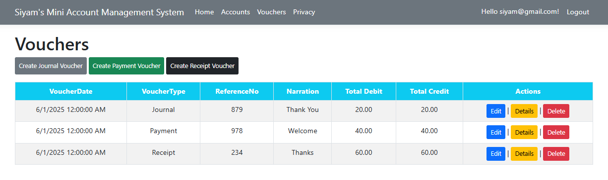


###  🧾  Voucher Details Page
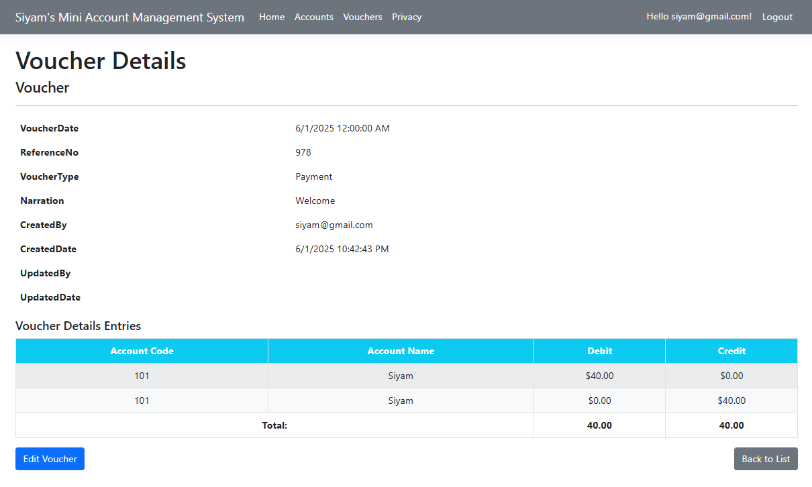


###  🧾  New Voucher is Creating
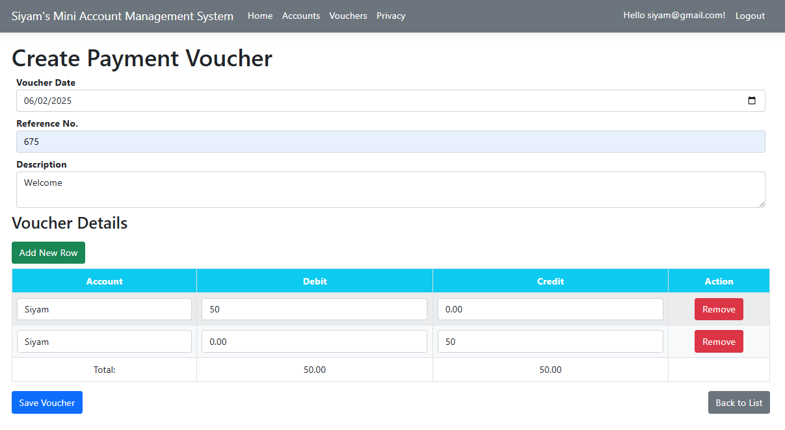


###  🧾  Existing Voucher is Updating

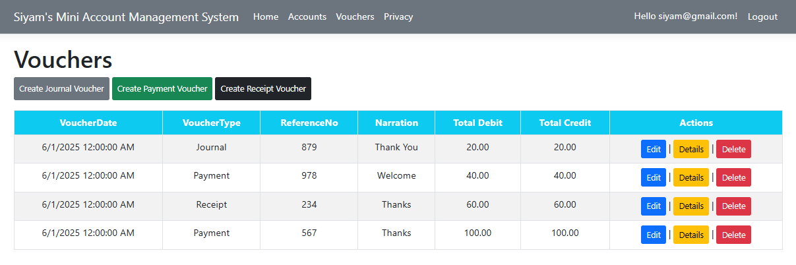


###  🧾  Existing Voucher is Deleting

